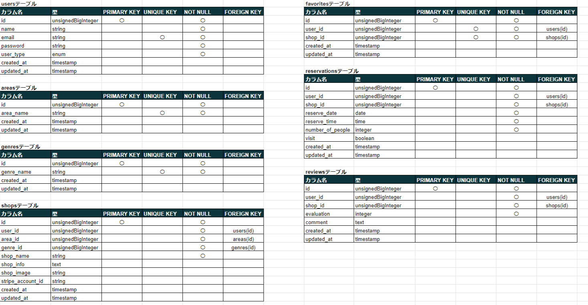
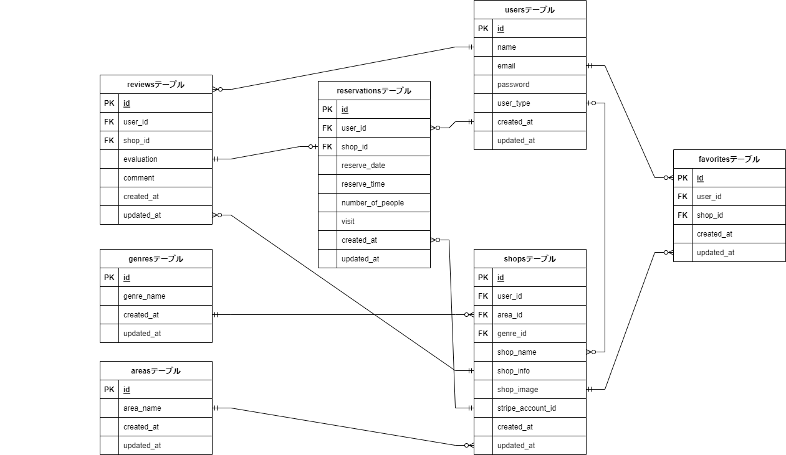

# Rese（飲食店アプリ）

## 作成した目的
外部の飲食店予約サービスではなく自社で予約サービスを持つことによってコストを削減したい。

## 機能一覧
- 会員登録
- ログイン
- ログアウト
- ユーザー情報取得
- ユーザー飲食店お気に入り一覧取得
- ユーザー飲食店予約情報取得
- 飲食店一覧取得
- 飲食店詳細取得
- 飲食店お気に入り追加
- 飲食店お気に入り削除
- 飲食店予約情報追加
- 飲食店予約情報削除
- エリアで検索する
- ジャンルで検索する
- 店名で検索する
- 飲食店予約情報変更
- 来店済み店舗情報取得
- 5段階評価機能
- レビュー機能
- ユーザー登録時のメール認証機能
- 予約者へ予約当日朝にリマインダーメール送信
- 飲食店情報登録（店舗代表者画面）
- 飲食店情報編集（店舗代表者画面）
- 飲食店情報削除（店舗代表者画面）
- 来店チェックイン機能（店舗代表者アカウント）
- 来店チェックイン用QRコード生成
- Stripeアカウント作成
- Stripeを利用した決済機能
- ユーザーアカウント作成（管理者画面）
- ユーザーアカウント編集（管理者画面）
- ユーザーアカウント削除（管理者画面）
- 飲食店情報登録（管理者画面）
- 飲食店情報編集（管理者画面）
- 飲食店情報削除（管理者画面）
- エリア情報登録（管理者画面）
- エリア情報編集（管理者画面）
- エリア情報削除（管理者画面）
- ジャンル情報登録（管理者画面）
- ジャンル情報編集（管理者画面）
- ジャンル情報削除（管理者画面）


## 環境構築

### Dockerビルド
1. リポジトリをクローン
    ```bash
    git clone git@github.com:sekishuu/rese.git
    ```

2. DockerDesktopアプリを立ち上げる

3. Dockerコンテナをビルドおよび起動
    ```bash
    docker-compose up -d --build
    ```

### Laravel環境構築

1. PHPコンテナに入る
    ```bash
    docker-compose exec php bash
    ```

2. Composerで依存関係をインストール
    ```bash
    composer install
    ```

3. 環境変数ファイルの設定
    「.env.example」ファイルを 「.env」ファイルに命名を変更。または、新しく.envファイルを作成
    ```bash
    cp .env.example .env
    ```

4. .envに以下の環境変数を追加（必要に応じて編集）
    ```env
    DB_CONNECTION=mysql
    DB_HOST=db
    DB_PORT=3306
    DB_DATABASE=laravel_db
    DB_USERNAME=laravel_user
    DB_PASSWORD=laravel_pass

    MAIL_MAILER=smtp
    MAIL_HOST=sandbox.smtp.mailtrap.io
    MAIL_PORT=2525
    MAIL_USERNAME=538aeb2637eb8c
    MAIL_PASSWORD=8f3a37b3bf3d93
    MAIL_ENCRYPTION=tls
    MAIL_FROM_ADDRESS=rese.test@example.com
    MAIL_FROM_NAME="${APP_NAME}"

    STRIPE_KEY=pk_test_51PThJd1M1ZoPwsX9f2HKyRgSnxmE6DAAPcRGAdoeFhyuuIiALaykbhMGZyEtQIRppBLzlk3nnTg46HoGEeRlujJs00Ui7CBuSn
    STRIPE_SECRET=sk_test_51PThJd1M1ZoPwsX9X1OtL4tmFL8JBm8C3Y1uFC7QzclVbl4BaHhZYURz6X9kSrH3VjbJF4ceyPOrmsTLkPzBySiy008OYXZfcm
    ```

5. アプリケーションキーの作成
    ```bash
    php artisan key:generate
    ```
    
6. Doctrine DBAL パッケージのインストール
    ```bash
    composer require doctrine/dbal
    ```

7. マイグレーションの実行
    ```bash
    php artisan migrate
    ```

8. シーディングの実行
    ```bash
    php artisan db:seed
    ```

9. シンボリックリンクの作成
    ```bash
    php artisan storage:link
    ```

## タスクスケジュール（CRON）の設定

1. サーバーで以下のコマンドを実行してCRONジョブを設定
    ```bash
    crontab -e
    ```

2. 以下のエントリを追加して保存
    ```bash
    * * * * * cd /path/to/your/project && php artisan schedule:run >> /dev/null 2>&1
    ```

## 使用技術(実行環境)
- PHP: 8.3.2
- Laravel: 8.83.27
- MySQL: 8.0.37

## テーブル設計


## ER図


## URL
- 開発環境：http://localhost/
- phpMyAdmin:：http://localhost:8080/

## サイトイメージ画像

### 飲食店一覧画面


### 店舗代表者画面


### サイト管理者画面


## アカウントの種類
- general：一般ユーザー
- shop_owner：店舗代表者
- admin：サイト管理者

## テストアカウントログイン用メールアドレス
- 一般ユーザー：ippan@example.com
- 店舗代表者：tenpo@example.com
- サイト管理者：admin@example.com
  
※PWは0000
